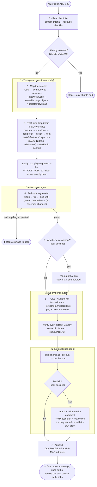

# End2End Tester Playwright Framework

Standalone Playwright E2E suite for any web app, plus the `e2e-ticket` AI workflow (slash command, subagents, skills, hooks) that authors and evidences it. Tests run against **deployed environments** via `.env.*` — this repo never builds the app under test. The default environment targets public sample apps, so a fresh clone runs green before you configure anything:

```bash
nvm use && npm ci && npx playwright install --with-deps chromium
npm test        # 10 tests, no credentials required
```

Companion docs:
- **`AGENTS.md`** — the conventions contract (layout, tags, data discipline, evidence). Read it before adding specs.
- **`COVERAGE.md`** — the coverage ledger: which tickets are covered by which specs.
- **`docs/APP-MAP.md`** — accumulated app knowledge (routes, helpers, quirks).
- **`.env.example` / `.env.publish.example`** — everything that has to be configured, with comments.

## Structure

```
tests/<feature>/         # specs grouped by feature domain (auth/, checkout/, inventory/, todo/)
tests/auth.setup.ts      # signs in once; the "setup" project every spec depends on
pages/                   # page objects (extend BasePage; barrel index.ts)
types/                   # shared types
utils/                   # env.ts (TEST_ENV/write-env/site), test-data.ts (e2eName), cleanup.ts (CleanupRegistry)
scripts/                 # publishing pipeline (attach / comment / plan / cycles / notify) + tool-sync check
templates/               # scaffolds for a new spec and a new page object
docs/                    # APP-MAP.md
evidence-reporter.ts     # renames evidence artifacts + writes the machine-readable results file
```

Ticket traceability is by **tag**, not by directory: `test.describe("...", { tag: "@ABC-123" }, ...)`. Run one ticket's tests with `TICKET=ABC-123 npm run test:dev`.

## Environments

`TEST_ENV` selects the `.env.<env>` file and the target. **Data safety is enforced in `playwright.config.ts`:** only the write envs (`demo`, `local`, `dev`, `staging` — `WRITE_ENVS` in `utils/env.ts`) run write/destructive flows; every other env is forced to `@smoke` (read-only) tests, so a write test can never touch shared/production data even if pointed there.

| TEST_ENV  | Target                              | Tests that run        | Credentials |
| --------- | ----------------------------------- | --------------------- | ----------- |
| `demo`    | public sample apps ²                | all (write + smoke)   | none needed |
| `local`   | `http://localhost:3000` ³           | all (write + smoke)   | yours |
| `dev`     | your deployed dev host              | all (write + smoke)   | yours |
| `staging` | your deployed staging host          | all (write + smoke)¹  | yours |
| `prod`    | your production host ⚠              | `@smoke` only          | yours |

⚠ **Ask before running against a shared or production environment** — that is a rule the agents follow too (`.cursor/rules/env-run-approval.mdc`). Demo and local need no approval.

¹ Staging writes apply to local/ad-hoc runs only: in CI staging stays `@smoke` unless `E2E_STAGING_WRITES=true` is deliberately set on the pipeline (`utils/env.ts` → `isWriteEnv`).

² `demo` is the default. It points at a public sample shop and the Playwright TodoMVC sample, with public credentials baked into `DEMO_DEFAULTS` in `utils/env.ts` — no `.env` file, nothing private, nothing to clean up.

³ This repo doesn't build the app: `TEST_ENV=local` expects your dev server already running on `:3000`. The other targets are **deployed** environments.

Write specs read the tenant from `E2E_SITE_NAME` (via `utils/env.ts` → `siteName()`) — never hardcode it.

## App source for selector tracing (optional)

The `e2e-explorer` agent traces route → components → selectors so specs are written against real roles and labels rather than guesses. It has three sources, in order of preference:

| Source | When |
| --- | --- |
| `docs/APP-MAP.md` | the route or widget driver is already recorded — use it and stop looking |
| An app checkout, via `APP_SOURCE_DIR` | you have the source on this machine; read it surgically, never wholesale |
| The running app, via the Playwright MCP server | there is no source — snapshot the page and read the accessibility tree |

Nothing is vendored into this repo and nothing is built here, so the suite stays small and the app stays the source of truth.

## Quick start

```bash
nvm use                                   # Node version from .nvmrc
npm ci
npx playwright install --with-deps chromium
```

```bash
# Environment files (all gitignored — never commit secrets); copy the examples:
#   .env.dev / .env.staging  → BASE_URL, E2E_USERNAME, E2E_PASSWORD, (E2E_SITE_NAME)
#   .env.publish             → tracker / wiki / test-management / chat providers + tokens

# Run (everything runs from the repo root)
npm test                                  # demo suite, no credentials
npm run test:dev                          # headless, full suite on your dev host
npm run test:headed                       # browser visible
npm run test:staging                      # full suite (write env)
npm run test:prod                         # @smoke only
TICKET=ABC-123 npm run test:dev           # only tests tagged @ABC-123
TICKET=ABC-123 npm run test:evidence      # per-ticket evidence bundle → evidence/ABC-123/
npm run typecheck && npm run check:tool-sync
```

In CI, `BASE_URL` and credentials come from repository secrets instead of a file.

### Point it at your app

1. Set `BASE_URL` and a dedicated test account in `.env.<environment>`.
2. Adapt `pages/LoginPage.ts` to your sign-in form. It is written against roles and placeholders, handles both a single form and the email-then-password pattern, and is the only file most apps need to change.
3. Replace the demo specs and `pages/demo/` with your own features, scaffolded from `templates/`.
4. If write tests must select a tenant or site, set `E2E_SITE_NAME` and implement the selection in a page object.

## Data safety: `@smoke` (read-only) vs write tests

- **`@smoke`** — tag read-only tests (no create/edit/delete). Safe on any env. Tag a whole file with `test.describe("...", { tag: "@smoke" }, () => { ... })`. See `tests/auth/sign-in.spec.ts` and `tests/inventory/product-list.spec.ts`.
- **Write tests** — tag with their ticket only (no `@smoke`), e.g. `{ tag: "@ABC-123" }`. The config's `grep` guard means they only run on write envs, never production.
- **Mandatory cleanup** (see `AGENTS.md` → Data discipline): every created entity is named with `e2eName("Kind")` (→ `E2E-Kind-…`, instantly identifiable if a crashed run leaves strays) and deleted in `afterEach` — either a page object's best-effort `delete*ByName` or `CleanupRegistry` (`utils/cleanup.ts`, LIFO) for multi-entity flows where a dependent must go before the record it points at.
- **Sessions carry state.** A test that changes something the saved session remembers (a cart, a draft, a filter) must undo it, or the next test starts dirty — that is exactly what `tests/checkout/cart-checkout.spec.ts` demonstrates.
- **Specs that exercise sign-in need a clean session:** `test.use({ storageState: { cookies: [], origins: [] } })`, otherwise the saved session skips straight past the form.
- Lists are often **paginated and sorted by name** — always search for the name before asserting a row; `E2E-…` names typically sort onto page 2+.

## Evidence captures (screenshots / videos for a ticket)

One command produces one ticket's complete evidence bundle, ready to publish:

```bash
TICKET=ABC-123 npm run test:evidence            # default env
TICKET=ABC-123 TEST_ENV=staging EVIDENCE=true npx playwright test
```

`EVIDENCE=true` captures a **screenshot and video for every test (pass or fail)** plus a trace; `TICKET=ABC-123` filters to that ticket's tagged tests and routes everything into `evidence/<TICKET>/`. The custom `evidence-reporter.ts` copies each test's artifacts to descriptive names derived from the test title, with the env in the filename so two envs coexist:

```
evidence/ABC-123/
  a-cart-can-be-checked-out-to-a-confirmation-dev.png / .webm / -trace.zip
  adding-products-updates-the-cart-badge-dev-FAILED.png   (failed tests keep their proof)
  results-dev.json        # machine-written: status, tags, media, error per test
  SUMMARY.md              # generated table, one column per env that ran
  artifacts/              # raw Playwright layout (kept for traceability)
  report/                 # browsable HTML report (npx playwright show-report evidence/ABC-123/report)
```

Everything under `evidence/` is git-ignored — regenerate on demand. Without `TICKET`, evidence goes to `evidence/` for the whole run. Normal runs stay fast and only keep artifacts on failure.

`results-<env>.json` is the part that makes publishing hands-off: the results table, the summary, and the wiki page are all generated from the run, so nobody ever types a row. A wrong row means the run was wrong.

### Evidence subject must be visible

A green test whose media shows a blank page, a spinner, the wrong scroll position, or a closed dialog is **invalid evidence**. Playwright's default end screenshot is the final viewport, so frame the subject first:

1. **Scroll it into view** (`scrollIntoViewIfNeeded`, or a page-object helper that centres the row).
2. **Keep the proving UI open** — don't dismiss the dialog or toast that carries the criterion.
3. **Attach a focused shot** when the end state is wrong for proof:
   ```ts
   await test.info().attach("screenshot", {
     body: await locator.screenshot(),
     contentType: "image/png",
   });
   ```
   The reporter promotes mid-test attachments over the end-of-test viewport for exactly this reason.
4. **Video**: end the test while the subject is still on screen, so the proving frames are in the `.webm`, not only the setup.

## Publishing results

One CLI turns a verified bundle into published results. Every provider is configured, never hardcoded, and anything set to `none` is skipped rather than failing the run:

```bash
cp .env.publish.example .env.publish             # then fill in what you use
node scripts/publish.mjs all --ticket ABC-123 --dry-run
node scripts/publish.mjs all --ticket ABC-123 --summary "Checkout regression"
```

| Command | What it does |
| --- | --- |
| `summary` | Write `SUMMARY.md` from the run results |
| `attach` | Upload the media the results table references, skipping anything already attached |
| `comment` | Post the results table with media **embedded inline**, not linked |
| `plan` | Create or update the test plan page on the wiki |
| `cycles` | Create test cases, a cycle per environment, and an execution per case |
| `notify` | Post a chat card, gated to `NOTIFY_ON_ENVS` and a fully green run |
| `cleanup` | Delete attachments no comment references, keeping anything it didn't upload |
| `all` | The whole sequence |

Providers: tracker `jira` or `github`, wiki `confluence`, test management `zephyr`, chat `teams` or `slack`. Swapping one means writing a single adapter in `scripts/lib/providers/` — the CLI and the evidence format don't change.

Two details worth knowing:

- **Inline media needs ADF.** A markdown comment can only *link* an attachment. The Jira adapter resolves each attachment to its media-services id and builds real media nodes, so thumbnails and playable video render inside the results table.
- **Cleanup is guarded.** A file is only a delete candidate when this pipeline uploaded it, it carries a capture-artifact extension, and no comment references it. Anything else is kept and reported, so source material someone attached by hand never disappears.

With no credentials every command runs as a **dry run**, which is also how you demo or review the pipeline safely.

**Every bug raised from a failure carries its own proof:** link it to the ticket under test, copy that case's `*-FAILED.png` / `*-FAILED.webm` into `evidence/<BUG-KEY>/`, then attach and comment on the bug so the media is embedded there. Proof left only on the parent ticket is incomplete.

## Reporting

Three reporters, all wired in `playwright.config.ts`:

- **HTML** — `npm run report` (or `evidence/<TICKET>/report/` in evidence mode).
- **Allure** — results land in `allure-results/`; `npm run allure` generates and opens the report. Good for trends across runs and for CI dashboards. Generating the HTML needs the bundled Allure CLI (`allure-commandline`, which needs Java); the results themselves need neither.
- **Evidence** — only in evidence mode, described above.

## What the sample suite proves

The demo specs exist so the framework is runnable and reviewable before it is pointed at anything private. Each one demonstrates a capability you will reuse:

| Spec | Capability |
| --- | --- |
| `tests/auth.setup.ts` | Sign in once, save the session, share it through a `setup` project dependency |
| `tests/auth/sign-in.spec.ts` | Clean-session sign-in, both the valid path and the rejected path |
| `tests/inventory/product-list.spec.ts` | Read-only `@smoke` assertions, including a sort order computed from the page |
| `tests/checkout/cart-checkout.spec.ts` | A state-changing flow with `CleanupRegistry` teardown, and a validation-error path |
| `tests/todo/todo-list.spec.ts` | A second app with no auth at all, with data named by `e2eName()` |

Replace them as you add your own features, and keep `COVERAGE.md` as the ledger.

## Auth is serialised under concurrency

Sign-in happens once in a `setup` project and every other spec inherits the saved session, so no test pays for a login. Hosted identity providers throttle bursts of token exchanges, so local runs cap `workers: 2` with `retries: 1` and CI stays serial (`workers: 1`). If you add many specs and start seeing mass navigation timeouts with an error dialog in the screenshot, lower `workers` further.

Escape hatches while iterating:

```bash
E2E_REUSE_AUTH=1 npm run test:dev    # reuse .auth/user.json, skip the sign-in
```

With no credentials configured for an environment, the setup step saves an empty session and annotates the run instead of failing, so public pages still run.

## CI (GitHub Actions)

This repo ships `.github/workflows/e2e.yml`.

- **Push and pull request** — typecheck, `check:tool-sync`, and the **full demo suite**. No secrets, so the result means something on a fresh fork. The HTML report and `allure-results/` are uploaded as artifacts.
- **On demand** — run against your own environment from the **Actions** tab (`workflow_dispatch`), optionally with a ticket key, which switches on evidence capture and uploads the bundle. Production stays `@smoke` through the config guard regardless of what you select.
- **Required secrets** for your environments: `BASE_URL`, `E2E_USERNAME`, `E2E_PASSWORD`. Optional: `E2E_SITE_NAME`, `E2E_LOGIN_PATH`.

Add a `schedule:` block when you want a nightly regression run.

## Authoring accelerators

The suite is built to make writing a new spec fast — **reuse before you write**:

- **Navigation** — `docs/APP-MAP.md` → "Navigation index" answers "how do I reach page X" (deep link or click path). Check it before hunting routes in the app.
- **Interactions** — `utils/interactions.ts` + `docs/APP-MAP.md` → "Helpers index" hold shared drivers (`waitForModalDetachedThenToast`, `collectPageErrors`). Reuse them instead of re-writing dialog code; extract a new helper the second time you write the same interaction, and register it in the Helpers index.
- **Scaffolds** — copy `templates/spec.template.ts` / `templates/page-object.template.ts` for a ready-to-fill shell (tags, cleanup, signed-in ritual, money-assertion placeholder).
- **Session is pre-loaded** — the `setup` project saves the signed-in session, so specs open the page directly instead of driving the login form every test.
- **Codegen** — after one run has written `.auth/user.json`, capture selectors and flows fast, then refine them into page objects (getByRole first — never paste raw codegen into specs):
  ```bash
  npx playwright codegen --load-storage=.auth/user.json "$BASE_URL"
  ```

## Adding e2e for a ticket

**Preferred: run `/e2e-ticket ABC-123`** (`.claude/commands/e2e-ticket.md`, mirrored at `.cursor/commands/e2e-ticket.md`) — it turns the ticket into a testable checklist, maps selectors via the `e2e-explorer` agent, writes tagged specs one proven slice at a time, regression-runs the set green via `e2e-runner`, produces and verifies the bundle via `e2e-evidence`, publishes via `e2e-publisher`, and appends the `COVERAGE.md` row.

### The full flow



Rules every step obeys live in `AGENTS.md`; credentials only in gitignored `.env.*` / `.env.publish`.

### AI tooling layout

The same workflow ships for two AI tools, and a checker keeps them honest:

- `.agents/skills/` — shared skills (`e2e-testing-patterns`, `tdd`), symlinked into `.claude/skills/` and `.cursor/skills/`
- `.claude/agents/` + `.cursor/agents/` — explorer, runner, evidence, publisher
- `.claude/commands/` + `.cursor/commands/` — the `e2e-ticket` pipeline
- `.cursor/rules/` — conventions, environment approval, evidence visibility, publishing
- `.claude/settings.json` hook nudges the e2e skill on test-related prompts; `.cursor/hooks.json` runs the sync check at session start
- `npm run check:tool-sync` fails when the two trees drift apart — edit both copies in one change

`skills-lock.json` lists useful third-party Playwright skills. They aren't vendored here; install them into `.agents/skills/` if you want them.

### Manual checklist (same rules — see `AGENTS.md`)

1. **Page Object** — add or extend a class in `pages/` for the screen you touch. Prefer `getByRole` selectors (see "Selectors: lessons learned" below).
2. **Spec** — add `tests/<feature-domain>/<flow>.spec.ts` (feature dirs, never ticket dirs). Start from the signed-in ritual, then drive the flow.
3. **Prove it can fail** — one test at a time (never batch-write): first run red at the money assertion, or sensitivity-check a first-run green (mutate the key expectation → confirm it fails there → revert byte-exactly, never commit the mutation).
4. **Tag it** — always tag the describe block with the ticket: `{ tag: "@ABC-123" }`. Add `"@smoke"` too only if it's read-only (then it also runs on production).
5. **Data discipline** — created entities use `e2eName("Kind")` and are deleted in `afterEach` (`CleanupRegistry` for multi-entity flows). Tenant via `siteName()`.
6. **Run it headed** before pushing: `npm run test:headed -- tests/<feature>/<flow>.spec.ts`.
7. **Ledger** — add the ticket's row to `COVERAGE.md`.

### Signed-in ritual (we are already signed in)

Before any test that needs the app, we run a **signed-in ritual** so we know where we are:

1. **Auth** — the `setup` project signs in once and saves the session; every test starts with it.
2. **Open the page** — the page object's `open()` navigates, clears a first-run dialog if one appears, and waits out any busy indicator.
3. **Prove the shell** — assert something only the loaded page renders (a heading, the page title).

After this we are **guaranteed to be signed in and on a rendered page**; tests can then navigate anywhere. Keep that ritual in the page object, not copied into every spec.

### Run a single case (one file / one test)

Use `--` before Playwright options so npm passes them through (all commands from the repo root):

```bash
# One spec file
npm run test:dev -- tests/checkout/cart-checkout.spec.ts

# One test by name (grep)
npm run test:dev -- -g "confirmation"

# Both, watched in a browser
npm run test:headed -- tests/checkout/cart-checkout.spec.ts -g "confirmation"
```

Without the `--`, you may see "No tests found" because the filter never reaches Playwright.

### UI Mode (interactive)

Opens Playwright's UI so you can run tests, watch the run, step through, and use **Pick locator** or **Trace** to explore the page.

```bash
npm run test:ui
```

**Tip:** the first time you use UI mode (or after clearing `.auth/`), run **Run all** once so the `setup` project saves the login state (`.auth/user.json`). After that, running a single test uses that state. Test timeout is 90s so slower create/edit/delete flows don't time out in UI or headed mode.

---

## Selectors: lessons learned

### Prefer `getByRole` over IDs and raw CSS

- **Problem:** Pages can have duplicate DOM (e.g. mobile + desktop copies of the same form with the same IDs). Using `locator("#id")` picks the **first in DOM order**. If the first copy is hidden (e.g. the mobile form on a desktop viewport), you end up filling or clicking the **hidden** element — the UI doesn't change and tests seem to "do nothing".
- **Fix:** Use selectors that target what's actually exposed and visible — role-based selectors, or a stable `name`/`data-test` attribute for fields whose role doesn't resolve.
- **Rule:** For inputs and buttons, prefer `getByRole('textbox', { name: '...' })` / `getByRole('button', { name: '...' })` over `locator("#id")` when the page has duplicate markup.

### `.or()` needs `.first()` on the composition

Two single-element locators combined with `.or()` resolve to **two** elements and trip strict mode:

```ts
// wrong — resolves to 2 elements
expect(this.usernameInput.or(this.passwordInput))
// right
expect(this.usernameInput.or(this.passwordInput).first())
```

### Sign-in flows

Hosted sign-in is the most fragile part of any suite. Two shapes cover most of them, and `pages/LoginPage.ts` handles both:

- **Single form** — username and password on one screen, then submit.
- **Email first** — an email field and Continue, then a password field on the next screen.

> ⚠️ **Do not** wait on the app URL alone after submit. Sign-in URLs embed `redirect_uri=…`, so a naive app-host `waitForURL` can match **while still on the identity provider**. Wait for a signal that only exists after the exchange: the password field detaching, a token in storage, or a known element of your shell.

If your app federates to a corporate identity provider, keep a non-federated test account — otherwise the run lands on a third-party password page the suite has no business automating.

### Duplicate IDs and strict mode

If you see "strict mode violation: locator resolved to 2 elements", the page has duplicate matching nodes. Scoping to "the first form" by DOM order can still target the wrong (hidden) form. Prefer `getByRole` so the engine picks the visible control, or add `.filter({ visible: true })`.

### When you must use IDs or form scope

If you have a single form and no duplicate markup, `form[name="..."]` + `#id` is fine. For responsive pages that duplicate the form, default to `getByRole` for the interactive elements.

---

## After submit: dialog then toast

When a flow submits a form in a **dialog** and the app shows a **success toast**:

1. **Wait for the dialog to be gone first** — it may show a loading state before closing. Wait for it to be **detached** from the DOM.
2. **Then assert the toast** — only once the dialog is gone.

**Why this order:** if you assert the toast while the dialog is still open or loading, you race with its DOM and get flaky failures. Confirming the dialog closed means the request finished, which keeps the toast assertion stable. `waitForModalDetachedThenToast` (`utils/interactions.ts`) does both in one call.

Toasts usually auto-dismiss after a few seconds, so assert them before anything slow, and capture evidence while they're still on screen.

> ⚠ **Deployed markup beats source.** What's deployed can lag or lead the source you're reading — always derive selectors from the DOM in the running environment.

---

## How to add / "teach" a new selector

When you need to select something on the page (dropdown, button, link, input), use one of these and share the result.

### Option A: Inspect and send HTML (best for one-off elements)

1. Open the page in the browser (e.g. run `npm run test:headed` and let it sign in, or open the app manually).
2. Right-click the element → **Inspect**.
3. In DevTools, right-click the highlighted node → **Copy** → **Copy element** (or **Copy outerHTML**).
4. Paste that into the chat and say what the element is (e.g. "site dropdown", "client select").
5. You get back a stable selector, preferring `getByRole` / `getByLabel` when the page has duplicate markup.

### Option B: Describe what the user sees

Send a short description, for example:

- "A dropdown labelled **Site** with options like 'Site A', 'Site B'."
- "A button that says **Save** in the header."
- "A combobox with placeholder **Select client**."

You get a proposed locator (e.g. `page.getByRole('combobox', { name: 'Site' })`). If the first suggestion doesn't match, refine using Option A.

### Option C: Let Playwright generate the selectors (good for flows)

1. From the repo root, after one run has created `.auth/user.json`:
   `npx playwright codegen --load-storage=.auth/user.json "$BASE_URL"` — opens codegen **already authenticated**.
2. In the opened browser, do the exact flow.
3. Copy the generated code (the `getByRole` / `click` / `fill` lines).
4. Paste it into the chat; it gets turned into a page object or test steps consistent with the rules above (getByRole first, avoid fragile IDs where the DOM is duplicated).

### What to send in one sentence

- **Option A:** "Here's the HTML for [element name]:" + pasted HTML.
- **Option B:** "I need to select [element name]; on the page it looks like [label/text/placeholder]."
- **Option C:** "Here's the codegen output for [flow name]:" + pasted script.
