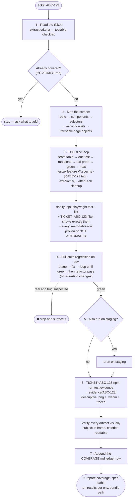

# End2End Tester Playwright Framework

A standalone Playwright end-to-end suite you can point at any web app, plus the ticket workflow that authors and evidences it. Tests run against **deployed environments** selected by `.env.*` files — this repo never builds the app under test.

Use it as a GitHub template, then adapt the login page object, the routes, and the environment names to your product.

Companion docs:
- **`AGENTS.md`** — the conventions contract (layout, tags, data discipline, evidence). Read it before adding specs.
- **`COVERAGE.md`** — the ledger: which tickets are covered by which specs.
- **`docs/APP-MAP.md`** — accumulated app knowledge (routes, helpers, quirks).

## Structure

```
tests/<feature>/         # specs grouped by feature domain (auth/, example/, …)
pages/                   # page objects (extend BasePage; barrel index.ts)
types/                   # shared types
utils/                   # env.ts (TEST_ENV/write-env/site), test-data.ts (e2eName), cleanup.ts (CleanupRegistry)
docs/                    # APP-MAP.md
templates/               # copy-paste scaffolds (not compiled)
evidence-reporter.ts     # renames evidence artifacts to descriptive per-test names
```

Ticket traceability is by **tag**, not by directory: `test.describe("...", { tag: "@ABC-123" }, ...)`. Run one ticket's tests with `TICKET=ABC-123 npm run test:dev`.

## Environments

`TEST_ENV` selects the `.env.<env>` file and the target. **Data safety is enforced in `playwright.config.ts`:** only the write envs (`local`, `dev`, `staging` — `WRITE_ENVS` in `utils/env.ts`) run write/destructive flows; every other env is forced to `@smoke` (read-only) tests, so a write test can never touch production data even if pointed there.

| TEST_ENV  | Target                            | Tests that run       |
| --------- | --------------------------------- | -------------------- |
| `local`   | `http://localhost:3000` ²         | all (write + smoke)  |
| `dev`     | your deployed dev host            | all (write + smoke)  |
| `staging` | your deployed staging host        | all (write + smoke)¹ |
| `prod`    | your production host              | `@smoke` only        |

¹ Staging writes apply to local/ad-hoc runs only: in CI staging stays `@smoke` unless `E2E_STAGING_WRITES=true` is deliberately set on the pipeline (`utils/env.ts` → `isWriteEnv`).

² This repo doesn't build the app: `TEST_ENV=local` expects your dev server already running on `:3000`. The default targets are the **deployed** environments.

Rename or add environments by editing `WRITE_ENVS` in `utils/env.ts` and the matching npm scripts. Write specs read the tenant/site from `E2E_SITE_NAME` (via `utils/env.ts` → `siteName()`) — never hardcode it.

## Quick start

```bash
nvm use                                    # Node version from .nvmrc
npm ci
npx playwright install --with-deps chromium
cp .env.example .env.dev                   # then fill in your own values
```

```bash
# Environment files (all gitignored — never commit secrets)
#   .env.local / .env.dev / .env.staging / .env.prod
#     → BASE_URL, E2E_USERNAME, E2E_PASSWORD, and optionally
#       E2E_LOGIN_PATH, E2E_HOME_PATH, E2E_HOME_HEADING, E2E_SITE_NAME

# Run (everything runs from the repo root)
npm run test:dev                           # headless, full suite on deployed dev
npm run test:headed                        # browser visible
npm run test:staging                       # full suite (write env)
npm run test:prod                          # @smoke only
TICKET=ABC-123 npm run test:dev            # only tests tagged @ABC-123
TICKET=ABC-123 npm run test:evidence       # per-ticket evidence bundle → evidence/ABC-123/
npm run typecheck
```

In CI, `BASE_URL` and credentials come from repository secrets instead of a file.

### Point it at your app

1. Set `BASE_URL` and a dedicated test account in `.env.<environment>`.
2. Match `pages/LoginPage.ts` to your sign-in form (roles and labels first). It already handles a single form and the email-then-password pattern.
3. Set `E2E_HOME_PATH` and `E2E_HOME_HEADING` so the smoke test proves the shell loaded.
4. If write tests must pick a tenant or site, set `E2E_SITE_NAME` and implement `HomePage.ensureSiteSelected`.
5. Replace `tests/example/` (ignored until `E2E_INCLUDE_EXAMPLES=1`) with a real feature.

## Data safety: `@smoke` (read-only) vs write tests

- **`@smoke`** — tag read-only tests (no create/edit/delete). Safe on any env. Tag a whole file with `test.describe("...", { tag: "@smoke" }, () => { ... })`. See `tests/auth/smoke.spec.ts`.
- **Write tests** — tag with their ticket only (no `@smoke`), e.g. `{ tag: "@ABC-123" }`. The config's `grep` guard means they only run on write envs, never production.
- **Mandatory cleanup** — every created entity is named with `e2eName("Kind")` (→ `E2E-Kind-…`, instantly identifiable if a crashed run leaves strays) and deleted in `afterEach` — either a page object's best-effort `delete*ByName` or `CleanupRegistry` (`utils/cleanup.ts`, LIFO) for multi-entity flows where a dependent must be removed before the record it points at.
- **Watch for paginated, sorted lists** — search for the name before asserting a row; `E2E-…` names often sort onto page 2+.
- **Leaks are worth recording.** If a screen has no delete, note it in `COVERAGE.md` and prefer an API-based cleanup rather than letting each run add a row.

## Evidence captures (screenshots / videos for a ticket)

One command produces one ticket's complete bundle, ready to attach to a ticket or a pull request:

```bash
TICKET=ABC-123 npm run test:evidence
```

`EVIDENCE=true` captures a **screenshot and video for every test (pass or fail)** plus a trace; `TICKET=ABC-123` filters to that ticket's tagged tests and routes everything into `evidence/ABC-123/`. The custom `evidence-reporter.ts` copies each test's artifacts to descriptive names derived from the test title, with the environment in the filename so two environments can sit side by side:

```
evidence/ABC-123/
  creates-an-item-that-appears-in-the-list-dev.png / .webm / -trace.zip
  deletes-an-item-dev-FAILED.png / .webm                  (failed tests get a -FAILED suffix)
  artifacts/              # raw Playwright layout (kept for traceability)
  report/                 # browsable HTML report (npx playwright show-report evidence/ABC-123/report)
```

Everything under `evidence/` is git-ignored — regenerate on demand. Without `TICKET`, evidence goes to `evidence/` for the whole run. Normal runs (without `EVIDENCE`) stay fast and only keep artifacts on failure.

### The subject must be visible

A green test whose screenshot shows a blank page, a spinner, the wrong scroll position, or a closed dialog is not proof. Playwright's default end-of-test shot is the final viewport, so frame the subject before the test ends:

- Scroll it into view (`scrollIntoViewIfNeeded`, or a page-object helper that centres the row).
- Keep the proving UI open — don't dismiss the dialog or toast that carries the criterion.
- Attach a focused shot mid-test when the end state would hide it:

```ts
await test.info().attach("screenshot", {
  body: await locator.screenshot(),
  contentType: "image/png",
});
```

- End the test while the subject is still on screen, so the proving frames are in the `.webm`.

## Auth is serialised under concurrency

Global setup signs in once and saves the session to `.auth/user.json`; every test starts from it. Hosted identity providers throttle bursts of sign-ins and token exchanges, so local runs cap `workers: 2` with `retries: 1`, and CI stays serial (`workers: 1`). If you add many specs and start seeing mass navigation timeouts with an error dialog in the screenshot, lower `workers` further.

Escape hatches while iterating:

```bash
E2E_REUSE_AUTH=1 npm run test:dev    # reuse .auth/user.json, skip the login
E2E_SKIP_AUTH=1 npm run test:dev     # save an empty session (public pages only)
```

## CI (GitHub Actions)

This repo ships `.github/workflows/e2e.yml`.

- **Push and pull request** — typecheck only, so the default branch stays cheap and green.
- **On demand** — run the suite from the **Actions** tab (`workflow_dispatch`) and pick the environment. Production stays on `@smoke` through the config guard regardless of what you select.
- **Required secrets:** `BASE_URL`, `E2E_USERNAME`, `E2E_PASSWORD`. Optional: `E2E_SITE_NAME`, `E2E_HOME_PATH`, `E2E_HOME_HEADING`, `E2E_LOGIN_PATH`.
- The HTML report is uploaded as an artifact on every dispatched run.

Add a schedule block to the workflow when you want a nightly regression run.

## Authoring accelerators

The suite is built to make writing a new spec fast — **reuse before you write**:

- **Navigation** — `docs/APP-MAP.md` → "Navigation index" answers "how do I reach page X" (deep link or click path). Check it before hunting routes.
- **Interactions** — `utils/interactions.ts` + `docs/APP-MAP.md` → "Helpers index" hold shared drivers (`waitForModalDetachedThenToast`, `collectPageErrors`). Reuse them instead of re-writing dialog and dropdown code; extract a new helper the second time you write the same interaction, and register it in the Helpers index.
- **Scaffolds** — copy `templates/spec.template.ts` / `templates/page-object.template.ts` for a ready-to-fill shell (tags, cleanup, signed-in ritual, money-assertion placeholder).
- **Session is pre-loaded** — `globalSetup` saves the signed-in session, so specs call `HomePage.open()` instead of driving the login form every test.
- **Codegen** — after one run has written `.auth/user.json`, open an authenticated recorder and refine what it gives you into page objects (never paste raw codegen into specs):

```bash
npx playwright codegen --load-storage=.auth/user.json "$BASE_URL"
```

## Adding e2e for a ticket

### The full flow



Rules every step obeys live in `AGENTS.md`; credentials only in gitignored `.env.*`.

### Manual checklist

1. **Page object** — add or extend a class in `pages/` for the screen you touch. Prefer `getByRole` selectors (see "Selectors: lessons learned" below).
2. **Spec** — add `tests/<feature-domain>/<flow>.spec.ts` (feature directories, never ticket directories). Start from the signed-in ritual (`home.open()`), then drive the flow.
3. **Prove it can fail** — one test at a time, never batch-written: the first run should be red at the money assertion. If it passes immediately because the feature already shipped, sensitivity-check it — mutate the key expectation, confirm it fails there, revert exactly, and never commit the mutation.
4. **Tag it** — always tag the describe block with the ticket: `{ tag: "@ABC-123" }`. Add `"@smoke"` too only if it's read-only, since that also runs it against production.
5. **Data discipline** — created entities use `e2eName("Kind")` and are deleted in `afterEach` (`CleanupRegistry` for multi-entity flows). Site via `siteName()`.
6. **Run it headed** before pushing: `npm run test:headed -- tests/<feature>/<flow>.spec.ts`.
7. **Ledger** — add the ticket's row to `COVERAGE.md`.

### Signed-in ritual (we are already signed in)

Before any test that needs the app, we run a **signed-in ritual** so we know we're on the landing page:

1. **Auth** — global setup signs in once and saves the session; tests start with it.
2. **Open the app** — `HomePage.open()` navigates to `E2E_HOME_PATH`, clears a first-run dialog if one appears, and waits out any busy indicator.
3. **Prove the shell** — `expectSignedIn()` waits for the heading named by `E2E_HOME_HEADING`.

After this we are guaranteed to be signed in and on a rendered page; tests can then navigate anywhere. Keep that ritual in `HomePage`, not copied into each spec.

### Run a single case (one file / one test)

Use `--` before Playwright options so npm passes them through (all commands from the repo root):

```bash
# One spec file
npm run test:dev -- tests/example/items.spec.ts

# One test by name (grep)
npm run test:dev -- -g "appears in the list"

# Both, watched in a browser
npm run test:headed -- tests/example/items.spec.ts -g "appears in the list"
```

Without the `--`, you may see "No tests found" because the filter never reaches Playwright.

### UI mode (interactive)

Opens Playwright's UI so you can run tests, watch the run, step through, and use **Pick locator** or **Trace** to explore the page.

```bash
npm run test:ui
```

**Tip:** the first time you use UI mode (or after clearing `.auth/`), run **Run all** once so `globalSetup` saves the session to `.auth/user.json`. After that, running a single test reuses it. The test timeout is 90s so slower create/edit/delete flows don't time out in UI or headed mode.

---

## Selectors: lessons learned

### Prefer `getByRole` over IDs and raw CSS

- **Problem:** pages can have duplicate DOM (for example mobile and desktop copies of the same form, sharing IDs). `locator("#id")` picks the **first in DOM order**. If that copy is hidden, you fill or click the **hidden** element, the UI doesn't change, and the test looks like it did nothing.
- **Fix:** target what is actually exposed and visible — role-based selectors, or a stable `name` attribute for form fields that roles don't resolve.
- **Rule:** for inputs and buttons prefer `getByRole('textbox', { name: '...' })` and `getByRole('button', { name: '...' })` over `locator("#id")` whenever the page has duplicate markup.

### Sign-in flows

Hosted sign-in is the most fragile part of any suite. Two patterns cover most of them, and `pages/LoginPage.ts` handles both:

- **Single form** — username and password on one screen, then submit.
- **Email first** — an email field and Continue, then a password field on the next screen.

> ⚠️ **Do not** wait on the app URL alone after submit. Sign-in URLs embed `redirect_uri=…`, so a naive `waitForURL` on your app host can match **while still on the identity provider**. Wait for a signal that only exists after the exchange: the password field detaching, a token in storage, or a known element of your shell.

If your app federates to a corporate identity provider, keep a non-federated test account. Otherwise the run ends up on a third-party password page the suite has no business automating.

### Duplicate IDs and strict mode

If you see "strict mode violation: locator resolved to 2 elements", the page has duplicate matching nodes. Scoping to "the first form" by DOM order can still target the hidden one. Prefer `getByRole` so the engine picks the visible control, or add `.filter({ visible: true })`.

### When you must use IDs or form scope

With a single form and no duplicate markup, `form[name="..."]` plus `#id` is fine. For responsive pages that duplicate the form, default to `getByRole` for the interactive elements.

---

## After submit: dialog then toast

When a flow submits a form in a **dialog** and the app shows a **success toast**:

1. **Wait for the dialog to be gone first.** It may show a loading state before closing. Wait for it to be detached from the DOM.
2. **Then assert the toast.**

**Why that order:** asserting the toast while the dialog is still open races with its DOM and produces flaky failures. Confirming the dialog closed means the request finished, which makes the toast assertion stable. `waitForModalDetachedThenToast` in `utils/interactions.ts` does both in one call.

Toasts usually auto-dismiss after a few seconds, so assert them before anything slow, and capture evidence while they are still on screen.

> ⚠ **Deployed markup beats source.** What is deployed can lag or lead the source you are reading. Derive selectors from the DOM you can actually see in the running environment.

---

## How to add or teach a new selector

When you need to select something on the page (dropdown, button, link, input), use one of these.

### Option A: inspect and send the HTML (best for one-off elements)

1. Open the page in a browser (run `npm run test:headed` and let it sign in, or open the app manually).
2. Right-click the element → **Inspect**.
3. In DevTools, right-click the highlighted node → **Copy** → **Copy element** (or **Copy outerHTML**).
4. Paste it into the chat and say what the element is ("site dropdown", "client select").
5. You get back a stable selector, preferring `getByRole` and `getByLabel` when the page has duplicate markup.

### Option B: describe what the user sees

For example:

- "A dropdown labelled **Site** with options like 'Site A', 'Site B'."
- "A button that says **Save** in the header."
- "A combobox with placeholder **Select client**."

You get a proposed locator such as `page.getByRole('combobox', { name: 'Site' })`. If the first suggestion doesn't match, refine with Option A.

### Option C: let Playwright generate the selectors (good for flows)

1. After one run has created `.auth/user.json`, open an authenticated recorder:
   `npx playwright codegen --load-storage=.auth/user.json "$BASE_URL"`.
2. In the opened browser, do the exact flow.
3. Copy the generated `getByRole` / `click` / `fill` lines.
4. Paste them in, and they get turned into a page object or test steps that follow the rules above (roles first, no fragile IDs where the DOM is duplicated).

### What to send in one sentence

- **Option A:** "Here's the HTML for [element name]:" plus the pasted HTML.
- **Option B:** "I need to select [element name]; on the page it looks like [label/text/placeholder]."
- **Option C:** "Here's the codegen output for [flow name]:" plus the pasted script.
