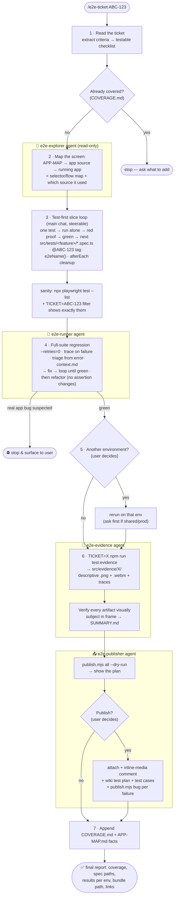

# End2End Tester Playwright Framework

A **Playwright** framework for end-to-end testing, plus the `/e2e-ticket` AI workflow that
authors, evidences and publishes it: page objects, environment-aware data safety, deterministic
evidence capture, Allure reporting, a configurable tracker / wiki / test-management / chat
publishing pipeline, and mirrored agent tooling for Cursor and Claude Code.

It runs against **deployed environments over HTTP**. There is no app build step. Clone it, run
`npm install && npm test`, and 13 UI and API tests go green against public sample apps with no
credentials.
Then point `BASE_URL` at your own application and replace the example page objects.

The conventions contract is [`AGENTS.md`](AGENTS.md). App knowledge lives in
[`docs/APP-MAP.md`](docs/APP-MAP.md); coverage in [`COVERAGE.md`](COVERAGE.md).

## Table of contents

- [Why this exists](#why-this-exists)
- [Key features](#key-features)
- [Framework benefits](#framework-benefits)
- [Folder structure](#folder-structure)
- [Quick start](#quick-start)
- [Windows setup (WSL)](#windows-setup-wsl)
- [Configuration](#configuration)
- [Running tests](#running-tests)
- [Writing a spec](#writing-a-spec)
- [Test data](#test-data)
- [Reporting](#reporting)
- [Evidence](#evidence)
- [Publishing pipeline](#publishing-pipeline)
- [QA artifact evals](#qa-artifact-evals)
- [AI-assisted development](#ai-assisted-development)
- [Best practices](#best-practices)
- [Troubleshooting](#troubleshooting)
- [Documentation index](#documentation-index)
- [NPM scripts](#npm-scripts)

## Why this exists

Most Playwright starters stop at "here is a page object". The parts that decide whether a suite
survives its second quarter are usually left as an exercise:

- **Keeping a destructive test away from production.** A grep guard in `playwright.config.ts`
  forces every non-write environment to `@smoke`. A spec cannot opt out of it.
- **Cleaning up after yourself.** Generated `E2E-` names plus last-in-first-out teardown, so a
  crashed run leaves recognisable debris instead of silently poisoning the next one.
- **Proving what you tested.** A run report and an acceptance record are different artifacts for
  different readers. Allure answers "what did the last run do"; the evidence bundle answers "which
  criterion does this screenshot prove".
- **Never typing a result by hand.** The results table, summary, wiki page and test cycles are all
  generated from the run's `results-<env>.json`. A wrong row means the run was wrong.
- **Getting proof to the people who sign off.** Media renders inline in the ticket comment and the
  wiki test plan, and every bug raised from a failure carries its own screenshot and video.

## Key features

- **Page Object Model** — locators and flows in `src/pages/` (extend `BasePage`, barrel
  `index.ts`); specs stay assertions. Prefer `getByRole` / `getByLabel`.
- **Environment configuration** — `TEST_ENV` selects a gitignored `.env.<TEST_ENV>`. Write
  environments are `WRITE_ENVS` in `src/utils/env.ts`; everything else runs `@smoke` only.
- **Ticket tagging** — `{ tag: "@ABC-123" }` on describes; run one ticket with `TICKET=ABC-123`.
  Specs live by feature, never by ticket.
- **Saved session** — a `setup` project signs in once to `.auth/user.json`, and every spec starts
  signed in.
- **Evidence capture** — `EVIDENCE=true` writes env-suffixed PNG / WebM / trace per test plus a
  machine-readable `results-<env>.json` into `src/evidence/<TICKET>/`.
- **Publishing pipeline** — one CLI attaches media, posts an inline-media results table,
  publishes a wiki test plan, plans and records test cases, raises bug proof and notifies chat.
  Jira or GitHub, Confluence, Zephyr Scale, Teams or Slack, each behind a swappable adapter.
- **Allure Report 3** — run report with trend, severity, failure categories and ticket links from
  tags. Node CLI, so **no Java** anywhere.
- **API testing ready** — `api` / `anonApi` fixtures with token or session auth, schema checks
  with `zod`, responses attached as evidence, and a template plus a worked example.
- **Data discipline** — unique entities via `e2eName()`, LIFO `CleanupRegistry` teardown.
- **Lint, format, secret scan** — ESLint (Playwright plugin on specs) and Prettier, with a Husky
  pre-commit hook that scans staged files for secrets and runs lint-staged. CI runs the same.
- **AI tooling** — `.claude/` agents, commands, rules and hooks copied into `.cursor/` by
  `npm run sync:ai`, plus shared skills, so Cursor and Claude Code run the same pipeline;
  `npm run check:tool-sync` fails on drift.
- **Type safety** — TypeScript throughout; `npm run typecheck` must pass.

## Framework benefits

| Who | Benefits |
| --- | --- |
| **Engineers** | One POM and one test-first loop, saved session, shared interaction helpers, scaffolds in `templates/`, authenticated codegen |
| **Teams** | Ticket tags (`TICKET=`), write vs read-only environments, `e2eName()` + cleanup so shared environments stay usable, `COVERAGE.md` and `docs/APP-MAP.md` as shared memory |
| **CI/CD** | Typecheck, lint, format check, secret scan and tool sync, then the demo suite. Screenshots and video on failure, retries when `CI=true`, Allure report uploaded as an artifact |
| **QA / sign-off** | Evidence bundles, inline-media ticket comments, wiki test plans, planned test cases with recorded results, bugs that carry their own proof — the acceptance record, kept separate from the run report |
| **Security** | Credentials only in gitignored `.env.*` / `.env.publish`, secret scan on every commit and in CI |

## Folder structure

Product code lives under `src/`; tooling stays at the repo root. Import `test` / `expect` from
`src/fixtures.ts`, never `@playwright/test` (ESLint enforces it in specs). Ticket traceability is
a Playwright tag filtered with `TICKET=<key>`, not a ticket folder.

```
End2End-Tester-Playwright-Framework/
│
├── .agents/skills/           # Shared skills, symlinked into .claude/skills and .cursor/skills
├── .claude/ / .cursor/       # Agents (explorer, runner, evidence, publisher) + /e2e-ticket; .claude is the source
│   ├── rules/                # conventions, env approval, evidence visibility, publishing
│   └── hooks                 # skill reminder (Claude prompt hook); hooks.json runs the sync check at session start (Cursor)
├── .husky/pre-commit         # scan-secrets --staged, then lint-staged
├── .github/workflows/e2e.yml # CI: checks + demo suite on push/PR; your envs on demand
├── .env.example              # Suite settings template (committed)
├── .env.publish.example      # Publishing providers template (committed)
├── .env.<TEST_ENV>           # Credentials per environment (gitignored)
├── .env.publish              # Tracker / wiki / test-management / chat tokens (gitignored)
├── .auth/                    # Saved session from the setup project (gitignored)
├── AGENTS.md                 # Conventions contract
├── CLAUDE.md                 # Claude Code entry point → AGENTS.md
├── COVERAGE.md               # Ticket coverage ledger
├── playwright.config.ts      # TEST_ENV, safety grep, workers, reporters, evidence mode
├── evidence-reporter.ts      # EVIDENCE=true → named media + results-<env>.json
├── allurerc.mjs              # Allure 3 report config (history, dashboard, quality gate)
├── eslint.config.mjs / .prettierrc
│
├── docs/
│   ├── APP-MAP.md            # Navigation index, helpers index, environment quirks
│   └── allure-history.jsonl  # Committed Allure trend (created by the first report)
│
├── scripts/
│   ├── publish.mjs           # The publishing CLI (see Publishing pipeline)
│   ├── lib/                  # config, evidence reader, ADF builders, logger
│   │   └── providers/        # tracker-jira, tracker-github, wiki-confluence, testmgmt-zephyr, chat-webhook
│   ├── app-source.mjs        # Which checkout APP_SOURCE_DIR points at
│   ├── scan-secrets.js       # Pre-commit + CI secret scanner
│   ├── sync-ai-mirrors.mjs   # Copies .claude into .cursor; --check fails on drift or a bad skill link
│   └── fix-deepeval.mjs      # postinstall workaround for a DeepEval packaging bug
│
├── templates/                # UI spec, API spec and page-object scaffolds, test-case plan, chat card
├── evals/                    # DeepEval checks on QA artifacts (Vitest)
│
└── src/
    ├── fixtures.ts           # The test / expect every spec imports, plus the api / anonApi fixtures
    ├── tests/
    │   ├── auth.setup.ts     # Signs in once → .auth/user.json
    │   └── auth/ checkout/ inventory/ posts/ todo/   # Example UI and API specs, by feature
    ├── pages/                # Page objects (BasePage, LoginPage, demo/)
    ├── utils/                # env, test-data, cleanup, interactions, api, allure-config
    ├── types/
    ├── evidence/<TICKET>/    # Generated captures (gitignored)
    └── test-results/         # Generated Playwright output (gitignored)
```

## Quick start

> **On Windows?** Do all of this inside WSL, not native Windows — jump to
> [Windows setup (WSL)](#windows-setup-wsl) first. macOS and Linux users carry straight on.

### Prerequisites

- **Node.js** 24.18.0 (`.nvmrc`) — `nvm use`. Anything ≥ 20 works.
- **Git**
- **Cursor** or **Claude Code** (optional, for the agent workflow)

No Java. Allure Report 3 ships a Node CLI.

### Install and see it green

```bash
git clone https://github.com/jramirez-automate/End2End-Tester-Playwright-Framework.git
cd End2End-Tester-Playwright-Framework
nvm use
npm install                                  # also installs the git hooks (prepare → husky)
npx playwright install --with-deps chromium
npm test                                     # 13 tests against public demo apps
```

That run needs no credentials and no `.env` file: `demo` is the default environment, and its
public targets (a sample shop and the Playwright TodoMVC app) are baked into `DEMO_DEFAULTS` in
`src/utils/env.ts`.

### Point it at your own app

```bash
cp .env.example .env.staging
# edit: BASE_URL, E2E_USERNAME, E2E_PASSWORD (and E2E_SITE_NAME if your app has tenants)
npm run test:staging
```

1. Adapt `src/pages/LoginPage.ts` to your sign-in form. It is written against roles and
   placeholders, handles both a single form and the email-then-password pattern, and is the only
   file most apps need to change.
2. Replace the demo specs and `src/pages/demo/` with your own features, scaffolded from
   `templates/`.
3. If write tests must select a tenant or site, set `E2E_SITE_NAME` and implement the selection in
   a page object.

## Windows setup (WSL)

> On Windows, run this suite inside **WSL** (Windows Subsystem for Linux), not native Windows.
> WSL avoids the path, line-ending, shell-script and Playwright-dependency friction of native
> Windows, and both Cursor and Claude Code integrate with it cleanly.

### 1. Install WSL

In an Administrator PowerShell, install WSL with its default Ubuntu distribution, then reboot:

```powershell
wsl --install
```

After the reboot, Ubuntu asks you to create a Linux username and password (separate from your
Windows login). If WSL is already present, `wsl --update` keeps it current and `wsl -l -v` lists
your distributions.

### 2. Install Node (nvm) and git inside WSL

```bash
sudo apt update && sudo apt install -y git curl
curl -o- https://raw.githubusercontent.com/nvm-sh/nvm/v0.40.1/install.sh | bash
# close and reopen the shell (or: source ~/.bashrc), then:
nvm install 24.18.0
```

### 3. Clone into the Linux filesystem

Clone into your WSL home, **not** a Windows path under `/mnt/c/…`. The Linux filesystem is far
faster for git and npm, and avoids line-ending and permission issues:

```bash
mkdir -p ~/projects && cd ~/projects
git clone https://github.com/jramirez-automate/End2End-Tester-Playwright-Framework.git
cd End2End-Tester-Playwright-Framework
```

### 4. Open it through WSL

**Cursor:** install Cursor on Windows and its WSL extension once, then run `cursor .` from the WSL
shell inside the repo.

**Claude Code:** install it inside WSL (`npm install -g @anthropic-ai/claude-code`), then run
`claude` from the repo directory.

Now finish [Quick start](#quick-start) from the WSL shell. `npm run report:allure` serves on
`http://localhost:8080`; WSL2 forwards `localhost`, so that URL opens in a Windows browser.

## Configuration

`TEST_ENV` selects a gitignored `.env.<TEST_ENV>` file. **Data safety is enforced in
`playwright.config.ts`:** only the write environments run create / edit / delete flows; every
other environment is forced to `@smoke` (read-only), so a write test can never touch production
data even when pointed there.

| TEST_ENV | Target | Tests that run | Credentials |
| --- | --- | --- | --- |
| `demo` | public sample apps (default) | write + smoke | none needed |
| `local` | `http://localhost:3000` ¹ | write + smoke | yours |
| `dev` | your deployed dev host | write + smoke | yours |
| `staging` | your deployed staging host | write + smoke ² | yours |
| `prod` (or any unlisted name) | production | `@smoke` only | yours |

¹ This repo does not build the app: `TEST_ENV=local` expects your dev server already running.

² In CI, staging stays `@smoke` unless `E2E_STAGING_WRITES=true` is set deliberately on the
pipeline (`isWriteEnv` in `src/utils/env.ts`).

⚠ **Ask before running against a shared or production environment.** The agents follow the same
rule (`.cursor/rules/env-run-approval.mdc`). Demo and local need no approval.

### Environment variables

Copy from `.env.example` — the full commentary lives there.

| Variable | Description | Required |
| --- | --- | --- |
| `BASE_URL` | Origin of the app under test (reduced to scheme + host) | Yes, outside `demo` |
| `E2E_USERNAME` / `E2E_PASSWORD` | Dedicated automation account, never a personal login | For signed-in specs |
| `E2E_LOGIN_PATH` | Where the sign-in form lives (default `/`) | No |
| `E2E_SITE_NAME` | Tenant / site / workspace for write tests, read via `siteName()` | If your app has one |
| `E2E_REUSE_AUTH` | `1` = reuse `.auth/user.json` and skip the sign-in step | No |
| `E2E_STAGING_WRITES` | `true` = allow write tests on staging in CI | No |
| `E2E_PROD_WRITES` | `true` = allow write tests on a `prod*` environment. Leave unset; the guard exists for a reason | No |
| `TODO_APP_URL` | Second demo target, used only by the TodoMVC specs | No |
| `API_BASE_URL` | API origin for the `api` fixture; falls back to `BASE_URL`. End it in `/` when it has a path | For API specs on a separate host |
| `API_TOKEN` | Token for the `api` fixture. Unset = reuse the signed-in browser session | If the API uses tokens |
| `API_AUTH_HEADER` / `API_AUTH_SCHEME` | Header and scheme for the token (default `Authorization: Bearer`) | No |
| `APP_SOURCE_DIR` | Local checkout of the app's frontend source for selector tracing | No |
| `APP_VERSION` | Build under test, shown in the Allure report | Recommended |
| `ALLURE_JIRA_BROWSE_URL` | Turns `@ABC-123` tags into Allure issue links | No |
| `ALLURE` | `false` = skip writing `allure-results/` for one run | No |
| `TICKET` / `EVIDENCE` | Filter to one ticket's tag / capture a bundle into `src/evidence/<TICKET>/` | Evidence runs |
| `HEADED` | `true` = visible browser with slow-mo | No |
| `PW_GLOBAL_TIMEOUT_MS` | Whole-run timeout (default 30 min; `0` disables) | No |

Publishing settings live separately in **`.env.publish`** (see
[Publishing pipeline](#publishing-pipeline)); eval judge settings in **`.env.eval`**.

**Priority:** `process.env` (CI / shell) → `.env.<TEST_ENV>` → the demo defaults.

### Local vs CI

```bash
# Local — one file per environment
cp .env.example .env.staging
npm run test:staging

# CI — repository secrets, no .env files
# BASE_URL, E2E_USERNAME, E2E_PASSWORD (optional: E2E_SITE_NAME, E2E_LOGIN_PATH)
```

`.github/workflows/e2e.yml` runs typecheck, lint, format check, secret scan, tool sync and the
full demo suite on every push and pull request — no secrets needed, so the result means something
on a fresh fork. Your own environments run on demand from the **Actions** tab
(`workflow_dispatch`), optionally with a ticket key, which switches on evidence capture and uploads
the bundle. Add a `schedule:` block for a nightly run.

## Running tests

```bash
npm test                       # TEST_ENV from the shell, else demo
npm run test:dev               # also test:local, test:staging, test:prod
npm run test:headed            # HEADED=true
npm run test:debug
npm run test:ui                # Playwright UI mode
```

### Run by tag or file

Put `--` before Playwright options so npm passes them through:

```bash
TICKET=ABC-123 npm run test:dev                                    # only tests tagged @ABC-123
npm run test:dev -- src/tests/checkout/cart-checkout.spec.ts       # one file
npm run test:dev -- -g "confirmation"                              # one test by title
npm run test:headed -- src/tests/checkout/cart-checkout.spec.ts -g "confirmation"
```

Without the `--` you may see "No tests found", because the filter never reaches Playwright.

In UI mode, run **Run all** once after clearing `.auth/`, so the `setup` project saves the session
that single-test runs then reuse.

### Auto-captured (no spec setup)

| What | When | Where |
| --- | --- | --- |
| Screenshot | On failure, or always when `EVIDENCE=true` | `src/test-results/` or `src/evidence/<TICKET>/` |
| Video | On the first retry, or always when `EVIDENCE=true` or headed | same |
| Trace | On the first retry, or always when `EVIDENCE=true` | same |

Timeouts: 90 s per test, 10 s per `expect`, 15 s per action (30 s headed), 30 s per navigation.

### Reading a failure

A failing test retries once locally and twice in CI, and the trace and video are recorded only on
that retry. That suits a suite run, but in a fix-and-rerun loop it doubles every run, leaves the
first failure without a trace, and lets a flake pass on its retry. While debugging, turn both off:

```bash
TEST_ENV=dev npx playwright test src/tests/checkout/cart-checkout.spec.ts --retries=0 --trace=retain-on-failure
```

Each failing test gets a folder in `src/test-results/`. Read it in this order:

1. **The error message** in the terminal.
2. **`error-context.md`** — the page's accessibility snapshot at the moment of failure. It usually
   shows why a locator missed: a different accessible name, a second dialog, or an element not
   rendered yet.
3. **The failure screenshot.**
4. **`trace.zip`**, when the first three aren't enough:
   `npx playwright show-trace src/test-results/<test>/trace.zip`.

The `e2e-runner` agent follows the same order and flags, except it never opens `show-trace` (a GUI
it cannot see). Leave these flags off `EVIDENCE=true` runs, which already record everything.

### Parallelism and sign-in

Sign-in happens once in the `setup` project and every spec inherits the saved session. Hosted
identity providers throttle bursts of token exchanges, so local runs use 2 workers and CI runs
serially. If mass navigation timeouts appear with an error dialog in the screenshot, lower the
workers. With no credentials for an environment, the setup step saves an empty session and
annotates the run instead of failing, so public pages still run. Chromium only.

## Writing a spec

Work test-first, one slice at a time: write **one** test, run it alone, see it fail at the
assertion that encodes the requirement, drive it green, then write the next. A first-run green
needs a sensitivity check — mutate the key expectation, confirm it fails there, revert it exactly.
Never batch-write specs. The full loop is in [`AGENTS.md`](AGENTS.md) and the `tdd` skill.

```bash
cp templates/spec.template.ts src/tests/<feature>/<name>.spec.ts
cp templates/page-object.template.ts src/pages/<Feature>Page.ts
npx playwright codegen --load-storage=.auth/user.json "$BASE_URL"   # authenticated codegen
```

Reuse before you write: `docs/APP-MAP.md` → **Navigation index** answers "how do I reach page X",
and the **Helpers index** plus `src/utils/interactions.ts` hold shared drivers
(`waitForModalDetachedThenToast`, `collectPageErrors`). Extract a helper the second time you write
the same interaction, and register it there. Never paste raw codegen into a spec.

### The signed-in ritual

1. **Auth** — the `setup` project has already signed in; every test starts with the session.
2. **Open the page** — the page object's `open()` navigates, clears a first-run dialog, and waits
   out any busy indicator.
3. **Prove the shell** — assert something only the loaded page renders (a heading, the title).

Keep the ritual in the page object, not copied into every spec.

### API tests

The structure is ready: point `API_BASE_URL` (and `API_TOKEN`, if the API uses tokens) at your
app and copy the template.

```bash
cp templates/api.spec.template.ts src/tests/<feature>/<name>.api.spec.ts
```

- **`api` fixture** — a request client for `API_BASE_URL` with this environment's auth, disposed
  after the test. Auth is `API_TOKEN` when set, otherwise the session the `setup` project saved, so
  cookie-authenticated APIs work with no extra config. **`anonApi`** sends no credentials, for 401
  checks. Never use Playwright's built-in `request` fixture: it targets the UI origin with no auth.
- **Helpers** in `src/utils/api.ts` — `describeResponse(res)` as the status assertion's message
  (URL plus the start of the body), `readBody(res, test.info())` to parse the body and attach it as
  the case's evidence, `parseWith(schema, body)` to check it against a non-strict `zod` schema and
  name the exact field that broke.
- **Same rules as UI specs** — tag the ticket, `@smoke` for reads, `e2eName()` for created data,
  and `new CleanupRegistry<APIRequestContext>()` with the delete registered as soon as the record
  exists. Write every test as `GIVEN` / `WHEN` / `THEN` steps with real values, because the step
  list is what a reviewer reads in place of a screenshot.
- **API vs UI** — contract facts the UI cannot show (status codes, field types, auth refusals) go
  in API specs; the behaviour a user sees goes in UI specs; prerequisite data that merely has to
  exist is best created through the API.

`src/tests/posts/posts.api.spec.ts` is the worked example against the public JSONPlaceholder
sample, which fakes writes, so the demo creates nothing. The `api-testing` skill has the full
guidance.

### Checklist

1. **Page object** in `src/pages/` for the screen you touch.
2. **Spec** in `src/tests/<feature>/<flow>.spec.ts` — feature folders, never ticket folders.
3. **Prove it can fail** before trusting a green.
4. **Tag it** with the ticket: `{ tag: "@ABC-123" }`. Add `"@smoke"` only if it is read-only, which
   also makes it run on production.
5. **Data discipline** — `e2eName()` and `afterEach` cleanup (see [Test data](#test-data)).
6. **Run it headed** before pushing: `npm run test:headed -- src/tests/<feature>/<flow>.spec.ts`.
7. **Ledger** — add the ticket's row to `COVERAGE.md`.

### What the sample suite shows

| Spec | Capability |
| --- | --- |
| `src/tests/auth.setup.ts` | Sign in once, save the session, share it through a `setup` project dependency |
| `src/tests/auth/sign-in.spec.ts` | Clean-session sign-in, both the valid path and the rejected path |
| `src/tests/inventory/product-list.spec.ts` | Read-only `@smoke` assertions, including a sort order computed from the page |
| `src/tests/checkout/cart-checkout.spec.ts` | A state-changing flow with `CleanupRegistry` teardown, and a validation-error path |
| `src/tests/todo/todo-list.spec.ts` | A second app with no auth at all, with data named by `e2eName()` |
| `src/tests/posts/posts.api.spec.ts` | API tests: `@smoke` reads with a schema check, a 404, and a create with API cleanup |

## Test data

Do not hardcode names, and do not leave rows behind.

```typescript
const name = e2eName("Order");          // E2E-Order-<timestamp>-<random>
cleanup.add(() => orders.deleteByName(name));
```

- **`e2eName()` / `e2eAlphaName()`** — unique names (`src/utils/test-data.ts`). The `E2E-` prefix
  is the contract: debris from a crashed run is recognisable and safe to purge.
- **`CleanupRegistry`** (`src/utils/cleanup.ts`) — LIFO teardown in `afterEach`, so a dependent is
  deleted before the record it points at.
- **Sessions carry state.** A test that changes something the saved session remembers (a cart, a
  draft, a filter) must undo it, or the next test starts dirty —
  `src/tests/checkout/cart-checkout.spec.ts` shows how.
- **Sign-in specs need a clean session:** `test.use({ storageState: { cookies: [], origins: [] } })`,
  otherwise the saved session skips straight past the form.
- **Lists are often paginated and sorted by name.** Search for the name before asserting a row;
  `E2E-…` names typically sort onto page 2 or later.

## Reporting

Two surfaces with different jobs. Do not substitute one for the other.

**Allure is the run report** — what the last execution did, how it trended, which failures
cluster. On by default (`ALLURE=false` to skip a run).

```bash
npm run report:allure            # generate, then serve on http://localhost:8080
npm run report:allure:generate   # generate only (CI)
npm run report:allure:gate       # advisory pass-rate gate
npm run allure:clean             # drop allure-results/ and allure-report/ before a fresh run
npm run report                   # Playwright's own HTML report
```

One `generate` builds both views — the per-test report and the dashboard. What the wiring adds
beyond stock (`src/utils/allure-config.ts` + `allurerc.mjs`):

- **Run identity** — environment, base URL, site, `APP_VERSION`, ticket and commit are recorded, so
  a green report still names its build.
- **Ticket links** — a `@ABC-123` describe tag becomes an issue link on every test, with no
  reporting calls in specs. Set `ALLURE_JIRA_BROWSE_URL`.
- **Grouping and severity** — fill `STORIES` in `src/utils/allure-config.ts` with each ticket's
  feature area and severity, so the report groups the way a release readout does.
- **Failure categories** — buckets by the *shape* of a failure (environment unreachable, server
  rejected the request, timeout, assertion, flaky). A shape survives the next release; a message
  from one build does not.
- **Trend** — history is appended to `docs/allure-history.jsonl`, which is committed so it
  survives a fresh clone. `allure-results/` and `allure-report/` are ignored.

Declare failures that are already raised defects under `resolutions` in `allurerc.mjs` (examples
there), then raise the quality gate's `successRate` so only a *new* failure breaks it. Never
hand-edit `known-issues.json`; the report writes that file itself.

## Evidence

**Evidence is the acceptance record** — TC ids, criteria, signed-off media. Allure has no notion
of a TC id or a criterion, so it never replaces an evidence bundle.

```bash
TICKET=ABC-123 npm run test:evidence
TICKET=ABC-123 TEST_ENV=staging EVIDENCE=true npx playwright test
```

`EVIDENCE=true` captures a screenshot, video and trace for **every** test, pass or fail.
`evidence-reporter.ts` copies them to descriptive, environment-suffixed names, so runs on two
environments coexist:

```
src/evidence/ABC-123/
  a-cart-can-be-checked-out-to-a-confirmation-dev.png / .webm / -trace.zip
  adding-products-updates-the-cart-badge-dev-FAILED.png   (failed tests keep their proof)
  results-dev.json        # machine-written: status, tags, media, error per test
  SUMMARY.md              # generated by publish, one column per env that ran
  artifacts/              # raw Playwright output
  report/                 # npx playwright show-report src/evidence/ABC-123/report
```

API cases have no screen, so their proof is `<test>-<env>-response.json` (request, status and
body, written by `readBody`), which publishing attaches like any other media and renders as a file
card. When a run has `*.api.spec.ts` cases, `SUMMARY.md`, the results comment and the wiki plan
split into **UI Tests** then **API Tests**, with TC ids running on from the UI rows. On the wiki
plan and the Jira comment, each section's table opens with its name across every column, then
`TC | Scenario | Steps | Expected result | <env>…`, then a bold row per feature group (the spec's
`test.describe` title) above that group's cases. Scenario, Steps and Expected result come from
`test-cases.json`; without a plan the table shows the test title and no Steps or Expected result
columns.

Everything under `src/evidence/` is gitignored — regenerate on demand. Screenshots are
1920×1080; videos record at 1280×720.

**Subject visibility is a hard rule.** A green test whose media shows a blank page, a spinner, the
wrong scroll position or a closed dialog is **invalid evidence**. Playwright's end-of-test
screenshot is the final viewport, so frame the subject first:

1. **Scroll it into view** (`scrollIntoViewIfNeeded`, or a page-object helper).
2. **Keep the proving UI open** — don't dismiss the dialog or toast that carries the criterion.
3. **Attach a focused shot** when the end state is wrong for proof. The reporter puts mid-test
   attachments first for exactly this reason:
   ```typescript
   await test.info().attach("screenshot", {
     body: await locator.screenshot(),
     contentType: "image/png",
   });
   ```
4. **End the test while the subject is still on screen**, so the video holds the proof, not only
   the setup.

## Publishing pipeline

One CLI turns a verified bundle into published results. Providers come from `.env.publish`
(copy `.env.publish.example`); anything set to `none`, or missing credentials, is skipped rather
than failing the run. No project key, space id or ticket prefix is hardcoded.

```bash
cp .env.publish.example .env.publish             # then fill in what you use
node scripts/publish.mjs all --ticket ABC-123 --dry-run
node scripts/publish.mjs all --ticket ABC-123 --summary "Checkout regression"
```

| Command | What it does |
| --- | --- |
| `summary` | Write `SUMMARY.md` from the run results |
| `attach` | Upload the media the results table references, skipping anything already attached. `--traces` adds each case's trace, `--only <text>` narrows by filename |
| `comment` | Post the results table with media **embedded inline**, not linked. Each filename resolves to its newest upload; `--uploaded-before <date>` rebuilds an earlier run's comment after a retest |
| `plan` | Create or update the wiki test plan with each case's media uploaded and embedded. `--target <name>` picks a destination, `--page-id` updates a known page, `--skip-media` republishes the body only |
| `cases` | Create planned test cases and a cycle from `src/evidence/<key>/test-cases.json`, **after** every automated case's spec passes. Needs `--create-cases` |
| `mark-pass` | Record the run's results against those planned cases |
| `cycles` | No plan: create cases from the run, a cycle per environment, an execution per case. Needs `--create-cases` |
| `notify` | Post a chat card, gated to `NOTIFY_ON_ENVS` and a fully green run |
| `cleanup` | Delete ticket attachments no comment or description references, keeping anything it didn't upload |
| `prune` | Delete wiki page attachments the current table no longer uses, keeping anything it didn't upload |
| `bug` | Give a bug its own proof: copy a failed case's media, attach it, embed it in the description, link the bug to the ticket, and add a redacted HAR of the failing run |
| `all` | `summary`, `attach`, `plan`, `mark-pass` (or `cycles`), `comment`, `notify` |

Providers: tracker `jira` or `github`, wiki `confluence`, test management `zephyr`, chat `teams`
or `slack`. Swapping one means writing a single adapter in `scripts/lib/providers/`.

With no credentials every command runs as a **dry run**, which is also how you review the
pipeline safely. `cleanup` and `prune` are the exception: they read the live issue or page, so they
skip without credentials.

Notes that save time:

- **Specs first, then Zephyr.** Draft the ticket's cases as `src/evidence/<key>/test-cases.json`
  (start from `templates/test-cases.example.json`) before writing specs, but keep the plan local.
  Once each spec passes, put its test title in the case's `test` field (or mark a case that stays
  manual `"manual": true`), then run `cases`. It refuses any automated case whose title is missing or
  not in the run's results, so a typo cannot create a wrong case. Each
  case gets numbered steps and one expected result, and the cycle holds a "Not Executed" execution
  per case; `all` then records results into it with `mark-pass`. The plan holds cases, never
  results. A case proved by a `*.api.spec.ts` gets `"layer": "api"` and a "Verify (API)" name, and
  is created labelled `API` and `Automated`; `cases` refuses a case whose layer doesn't match its
  spec. Plan an API case only when it maps to an acceptance criterion.
- **Zephyr cannot delete a test case.** `cases` and `cycles` only create cases when you pass
  `--create-cases`, so review the dry run's case list first. A second `cases` or `cycles` for the
  same ticket is refused unless you pass `--force`, which duplicates every case. The records of what
  was created (`zephyr.json`, `zephyr-cycles.json`) live in the gitignored bundle, so they exist
  only on the machine that published.
- **Every bug raised from a failure carries its own proof.** Create the bug, then:
  ```bash
  node scripts/publish.mjs bug --ticket BUG-7 --from ABC-123 --tc TC-003 --dry-run
  node scripts/publish.mjs bug --ticket BUG-7 --from ABC-123 --tc TC-003
  ```
  It copies that case's `*-FAILED.png` / `*-FAILED.webm` into `src/evidence/BUG-7/`, attaches
  them, embeds them in the bug's description under an **Evidence** heading (replaced, not
  duplicated, on a re-run), and links the bug to `ABC-123`. For a manual finding, save the media in
  `src/evidence/BUG-7/` and pass `--files a.png,b.webm` instead of `--tc`.
- **Bugs carry a HAR for the developers.** `bug` also turns the case's `*-FAILED-trace.zip` into
  `BUG-7-<env>.har` (`scripts/lib/har.mjs`), with auth headers, cookies and token fields redacted
  and only text bodies kept. It attaches the file and embeds it under a **Network capture** note
  that lists each failing call: method, path, status and error body. Import it in DevTools →
  Network. Playwright does not record `multipart/form-data` request bodies, and the note says so
  for such a call. A manual finding can add a DevTools-exported `.har` to `--files`, but strip its
  `Authorization` and `Cookie` headers first, because it is uploaded as it is.
- **Inline media needs ADF.** A markdown comment can only *link* an attachment. The Jira adapter
  resolves each attachment to its media id and builds real media nodes, so thumbnails and playable
  video render inside the table.
- **Deletion is guarded.** `cleanup` only deletes capture files this pipeline uploaded that nothing
  references, and deletes nothing while the issue has no embedded media yet. `prune` only deletes
  page attachments it marked as its own uploads. Anything else is kept and reported.
- **Wiki destinations are configuration.** `--target release` reads `CONFLUENCE_RELEASE_SPACE_ID`,
  `_SPACE_KEY` and `_PARENT_PAGE_ID`, falling back to the default space for anything unset.
- **TC ids are always `TC-001`, `TC-002`, …** and links go in one place: the publish run gathers
  the wiki page and the test cycles into the results comment.

## QA artifact evals

[DeepEval](https://deepeval.com) checks that test cases, bug reports and exploratory debriefs
follow the conventions in the QA skills (`test-case-design`, `bug-reporting`,
`exploratory-testing`). It runs on Vitest, separate from the Playwright suite:

```bash
npm run eval
```

Each artifact kind has a good and a bad sample in `evals/samples/<kind>/`, and every check must
pass the good one and fail the bad one — a check that passes both measures nothing.

| Check type | Examples | How it's scored | When it runs |
| --- | --- | --- | --- |
| **pattern** | `TC-###` ids, names start with **Verify**, `Environment:` block first, no file paths or selectors | Regular expression — instant, free, exact | Always |
| **judge** | All criteria covered, nothing invented, summary says what and where, concrete follow-ups | An LLM judge answering one yes/no question | Only when a judge is set in `.env.eval` |

Choose the judge in a gitignored `.env.eval` (options in `.env.example`):

- **Ollama** (local, free): install [Ollama](https://ollama.com), `ollama serve`,
  `ollama pull qwen2.5:7b`, then `EVAL_JUDGE=ollama`. Use a 7B model or larger — a 3B model
  misreads the artifacts and scores nearly everything 0.
- **Grok** (xAI API): `EVAL_JUDGE=grok` and `GROK_API_KEY`.

With no judge configured the judgment checks are skipped, not failed, so a fresh clone and CI stay
green.

> **Known DeepEval packaging bug.** The npm package (through at least 0.9.20) ships a stale
> `dist/telemetry.js` that shadows `dist/telemetry/`, so every metric throws
> `inComponentScope is not a function`. `postinstall` (`scripts/fix-deepeval.mjs`) deletes the
> stale file; remove that step once upstream fixes it.

## AI-assisted development

**Preferred: `/e2e-ticket ABC-123`** (`.claude/commands/e2e-ticket.md`, mirrored in `.cursor/`).
It turns the ticket into a testable checklist, maps selectors with the `e2e-explorer` agent,
writes tagged specs one proven slice at a time, runs the set green with `e2e-runner`, produces and
verifies the bundle with `e2e-evidence`, publishes with `e2e-publisher`, and appends the
`COVERAGE.md` row.


```mermaid
flowchart TD
    U(["/e2e-ticket ABC-123"]) --> A

    A["1 · Read the ticket<br/>extract criteria → testable checklist"] --> B{"Already covered?<br/>(COVERAGE.md)"}
    B -- "yes" --> STOP(["stop — ask what to add"])
    B -- "no" --> C

    subgraph EXPLORER["🔎 e2e-explorer agent (read-only)"]
        C["2 · Map the screen:<br/>APP-MAP → app source → running app<br/>= selector/flow map + which source it used"]
    end

    C --> E["3 · Test-first slice loop (main chat, steerable)<br/>one test → run alone → red proof → green → next<br/>src/tests/&lt;feature&gt;/*.spec.ts · @ABC-123 tag · e2eName() · afterEach cleanup"]
    E --> LIST["sanity: npx playwright test --list<br/>+ TICKET=ABC-123 filter shows exactly them"]

    subgraph RUNNER["🏃 e2e-runner agent"]
        F["4 · Full-suite regression<br/>--retries=0 · trace on failure · triage from error-context.md<br/>→ fix → loop until green · then refactor (no assertion changes)"]
    end

    LIST --> F
    F -- "real app bug suspected" --> BUG(["⛔ stop & surface to user"])
    F -- "green" --> Q1{"5 · Another environment?<br/>(user decides)"}
    Q1 -- "yes" --> F2["rerun on that env<br/>(ask first if shared/prod)"]
    Q1 -- "no" --> G
    F2 --> G

    subgraph EVIDENCE["📸 e2e-evidence agent"]
        G["6 · TICKET=X npm run test:evidence<br/>→ src/evidence/X/ descriptive .png + .webm + traces"]
        G --> H["Verify every artifact visually<br/>subject in frame → SUMMARY.md"]
    end

    subgraph PUBLISH["📤 e2e-publisher agent"]
        H --> I["publish.mjs all --dry-run<br/>→ show the plan"]
        I --> J{"Publish?<br/>(user decides)"}
        J -- "yes" --> K["attach + inline-media comment<br/>+ wiki test plan + test cases<br/>+ publish.mjs bug per failure"]
    end

    J -- "no" --> L
    K --> L["7 · Append COVERAGE.md + APP-MAP.md facts"]
    L --> DONE(["✅ final report: coverage, spec paths,<br/>results per env, bundle path, links"])
```

### Where selectors come from

The explorer works down three sources and uses the first one available, then reports which one it
used so a reviewer knows how far to trust the map:

| Source | When |
| --- | --- |
| `docs/APP-MAP.md` | The route or widget driver is already recorded — use it and stop looking |
| An app checkout via `APP_SOURCE_DIR` | The source is on this machine. `npm run -s app-source` prints the directory, branch and commit; the explorer reads it surgically, never wholesale |
| The running app via the Playwright MCP server | No source. Snapshot the page and read the accessibility tree, and say which states could not be reached |

Set `APP_SOURCE_DIR` in `.env.<environment>` (or your shell) to a checkout on the branch deployed to
that environment. Deployed markup can lag or lead source, so the running app wins any disagreement.
Nothing is vendored into this repo.

### Teaching a selector

- **Send HTML** — right-click the element → Inspect → Copy element, paste it with what it is.
- **Describe it** — "a combobox labelled **Site** with options Site A, Site B".
- **Send codegen** — `npx playwright codegen --load-storage=.auth/user.json "$BASE_URL"`, do the
  flow, paste the output. It becomes page-object code, `getByRole` first.

### Tooling layout

- `.agents/skills/` — shared skills (`e2e-testing-patterns`, `tdd`, `api-testing`, `bug-reporting`,
  `exploratory-testing`, `test-case-design`, and the third-party `playwright-best-practices`,
  `playwright-cli`, `playwright-generate-test`, `writing-for-agents`, `cursor-memory-curator`,
  `skill-eval-methodology`, `code-review`), symlinked into `.claude/skills/` and `.cursor/skills/`.
  `code-review` finds a ticket's spec through `docs/agents/issue-tracker.md`
- `.claude/agents/` — explorer, runner, evidence, publisher
- `.claude/commands/` — the `e2e-ticket` pipeline
- `.claude/rules/` — conventions, environment approval, evidence visibility, publishing
- `.claude/hooks/` — the skill reminder `.claude/settings.json` runs on test-related prompts
- `.cursor/` holds a copy of those four, made by `npm run sync:ai`. Edit `.claude/`, then sync; a
  direct edit to `.cursor/` is overwritten. Platform files are not copied: `.claude/settings.json`,
  `.cursor/hooks.json` (runs the sync check at session start) and `.cursor/mcp.json`
- `npm run check:tool-sync` fails on a stale copy, or a skill that isn't linked from both trees

`skills-lock.json` pins the source and hash of each vendored third-party skill. Where one
disagrees with `AGENTS.md`, `AGENTS.md` wins.

## Best practices

### Locators

Prefer `getByRole` / `getByLabel`; scope a dialog with `getByRole("dialog")`. Raw locators belong
in page objects, never specs.

- **Duplicate DOM.** Responsive pages often render the same form twice (mobile and desktop) with
  the same ids. `locator("#id")` picks the first in DOM order — often the hidden copy — and the test
  "does nothing". Role-based locators target what is exposed; add `.filter({ visible: true })` when
  needed.
- **`.or()` needs `.first()` on the composition.** Two single-element locators combined with
  `.or()` resolve to two elements and trip strict mode:
  ```typescript
  expect(this.usernameInput.or(this.passwordInput));          // wrong — 2 elements
  expect(this.usernameInput.or(this.passwordInput).first());  // right
  ```
- **Ids are fine** for a single form with no duplicate markup (`form[name="…"]` + `#id`).

### Sign-in flows

`src/pages/LoginPage.ts` handles a single form and the email-then-password pattern. **Do not**
wait on the app URL alone after submit: sign-in URLs embed `redirect_uri=…`, so a naive
`waitForURL` can match while still on the identity provider. Wait for a signal that only exists
after the exchange — the password field detaching, or a known element of your shell. If your app
federates to a corporate identity provider, keep a non-federated test account.

### Waits

```typescript
// BEST — state
await element.waitFor({ state: "visible" });
await waitForModalDetachedThenToast({ modal, toast });

// AVOID — fixed timeout (ESLint warns)
await page.waitForTimeout(5000);
```

Assert the success sequence in order: the dialog **detached** first, then the toast. Asserting the
toast alone races the dialog's DOM and passes while a failed save sits open. Toasts auto-dismiss,
so assert them — and capture evidence — before anything slow.

### Dynamic test data

```typescript
const name = e2eName("Order");   // CORRECT
const name = "My Order";         // WRONG — collisions and leftover rows
```

## Troubleshooting

| Issue | Solution |
| --- | --- |
| Credentials not loading | `TEST_ENV` must match `.env.<TEST_ENV>`; CI uses secrets, not the file |
| Sign-in specs skipped, signed-in pages show the login form | No `E2E_USERNAME` / `E2E_PASSWORD` for that environment — the setup step saved an empty session by design |
| Write tests are skipped | That environment is not a write environment, so only `@smoke` runs — by design |
| "No tests found" through npm | Put `--` before Playwright options: `npm run test:dev -- -g "title"` |
| A failure has no trace, or a flake passed on retry | Rerun with `--retries=0 --trace=retain-on-failure` — see [Reading a failure](#reading-a-failure) |
| Mass navigation timeouts with an error dialog | The identity provider is throttling sign-ins; lower workers, or `E2E_REUSE_AUTH=1` |
| Strict mode: locator resolved to 2 elements | Duplicate DOM or an `.or()` without `.first()` — see [Locators](#locators) |
| Leftover `E2E-*` rows | `e2eName()` + `CleanupRegistry` in `afterEach` |
| Evidence PNG is blank or the wrong screen | Scroll the subject into view and attach before dismissing — see [Evidence](#evidence) |
| `publish.mjs` says "No evidence bundle" | Run `TICKET=<key> npm run test:evidence` first; results come only from the run |
| Pre-commit hook does not run | Run `npm run prepare` once; `git config --get core.hooksPath` should print `.husky/_` |
| Secret scan flags a placeholder | Adjust the pattern or allow-list in `scripts/scan-secrets.js`; never bypass the hook |
| Allure generation crashes after editing `known-issues.json` | Rules belong in `allurerc.mjs` → `resolutions` |
| API spec gets HTML or hits the wrong path | `API_BASE_URL` points at the UI, or a request path starts with `/` and drops the base path |
| API spec returns 401 unexpectedly | No `API_TOKEN` and no saved session — set the token, or run the `setup` project first |
| Playwright browsers missing | `npx playwright install --with-deps chromium` |

## Documentation index

| Document | Contents |
| --- | --- |
| [`AGENTS.md`](AGENTS.md) | Conventions contract: layout, tags, data discipline, authoring loop, commands |
| [`CLAUDE.md`](CLAUDE.md) | Claude Code entry point |
| [`docs/APP-MAP.md`](docs/APP-MAP.md) | Navigation index, helpers index, environment quirks |
| [`COVERAGE.md`](COVERAGE.md) | Ticket coverage ledger |
| [`.env.example`](.env.example) | Suite, Allure and eval settings, with comments |
| [`.env.publish.example`](.env.publish.example) | Publishing providers and tokens, with comments |
| [`templates/`](templates/) | UI spec, API spec and page-object scaffolds, test-case plan, chat card |

## NPM scripts

| Script | Description |
| --- | --- |
| `npm test` / `test:demo` / `test:local` / `test:dev` / `test:staging` / `test:prod` | Run Playwright against a `TEST_ENV` |
| `npm run test:headed` / `test:debug` / `test:ui` | Visible / debug / UI mode |
| `npm run test:evidence` | Capture a bundle into `src/evidence/<TICKET>/` |
| `npm run report` | Playwright HTML report |
| `npm run report:allure` / `:generate` / `:gate` | Allure run report |
| `npm run allure:clean` | Delete `allure-results/` and `allure-report/` |
| `npm run publish -- <command>` | The publishing CLI; `publish:<command>` shortcuts exist for each command, `publish:dry` for a full dry run |
| `npm run eval` | DeepEval checks on QA artifacts |
| `npm run typecheck` | `tsc --noEmit` (suite + `evals/`) |
| `npm run lint` / `lint:fix` | ESLint |
| `npm run format` / `format:check` | Prettier |
| `npm run scan:secrets` / `:staged` / `:self-test` | Secret scanner |
| `npm run sync:ai` | Copy `.claude` agents, commands, rules and hooks into `.cursor` |
| `npm run check:tool-sync` | Fail when `.claude` and `.cursor` drift |
| `npm run -s app-source` | Show which checkout `APP_SOURCE_DIR` resolves to |
